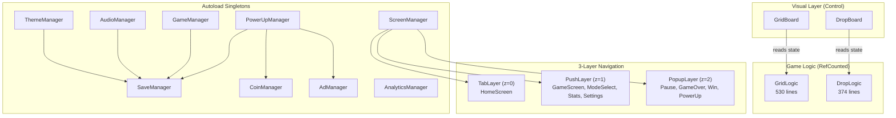

# 🎯 2048 Puzzle Game

> Multi-mode 2048 puzzle game with pure logic separation, built in Godot 4.6


**[Play Web Demo](https://aile1492.github.io/2048-puzzle-web)** · **[Portfolio (Notion)](https://www.notion.so/33413eca6587819398acf8a1a748d7cd)** · **[Architecture Docs](docs/architecture/system-architecture.md)** · **[Game Design](design/gdd/game-concept.md)**

---

## Highlights

- **5 Game Modes** — Classic, Zen, Time Attack, Daily Challenge, Drop (original tile-falling mode with chain combos)
- **Pure Logic/Visual Separation** — `GridLogic` is `RefCounted` with zero Node dependencies, fully unit-testable
- **3-Layer Navigation** — Tab/Push/Popup `CanvasLayer` system with `BaseScreen` lifecycle
- **Programmatic UI** — 100% code-built UI enabling instant Light/Dark theme switching
- **Game Economy** — Balanced coin rewards, 4 power-ups with inventory caps, daily ad limits

---

## Tech Stack

| Category | Details |
|----------|---------|
| **Engine** | Godot 4.6.1 (GL Compatibility) |
| **Language** | GDScript (static typing enforced) |
| **Viewport** | 1080×1920 portrait |
| **Platforms** | Android ARM64 (SDK 34), Web |
| **Testing** | GDScript assert-based unit tests |
| **Architecture** | 9 autoload singletons, RefCounted logic classes |

---

## Architecture Overview



<details>
<summary><b>Logic/Visual Separation</b></summary>

The core architecture decision: game logic lives in `RefCounted` classes with **zero Node dependencies**.

```
GridLogic (RefCounted)          GridBoard (Control)
├── move(direction)             ├── _animate_tiles()
├── spawn_tile()                ├── _update_visual()
├── is_game_over()              └── _on_input()
├── undo()                          │
└── signals:                        │ reads state from
    tiles_moved ──────────────────▶ │ GridLogic instance
    tile_spawned                    │
    score_changed                   │
```

**Why?** `GridLogic` can be instantiated and tested without a scene tree. The same pattern was reused for `DropLogic` when adding Drop mode — proving the architecture scales.

</details>

<details>
<summary><b>3-Layer Navigation System</b></summary>

```
┌─────────────────────────────────────┐
│  PopupLayer (z=2)                   │  ← Modal: Pause, GameOver, Win
│  ┌─────────────────────────────┐    │
│  │  PushLayer (z=1)            │    │  ← Stack: Game, Settings, Stats
│  │  ┌─────────────────────┐    │    │
│  │  │  TabLayer (z=0)     │    │    │  ← Always: HomeScreen
│  │  │  HomeScreen         │    │    │
│  │  └─────────────────────┘    │    │
│  └─────────────────────────────┘    │
└─────────────────────────────────────┘
```

All screens extend `BaseScreen` with `enter(data)` / `exit()` lifecycle methods. Popups overlay without destroying the game state underneath.

</details>

<details>
<summary><b>Game Modes</b></summary>

| Mode | Logic Class | Goal | Special Rules |
|------|-------------|------|---------------|
| **Classic** | GridLogic | Reach 2048 | Standard 4×4 grid |
| **Zen** | GridLogic | No goal | Unlimited undo, no game over |
| **Time Attack** | GridLogic | Highest score | 120-second countdown |
| **Daily Challenge** | GridLogic | Beat target score | Same seed worldwide per day |
| **Drop** | DropLogic | Reach 2048 | 5×8 grid, tiles fall from top, chain combos |

4 modes share `GridLogic` with 80% code reuse. Drop mode uses independent `DropLogic` with BFS flood-fill merging and chain multipliers (1.0x → 1.5x → 2.0x → 3.0x).

</details>

---

## Key Design Decisions

| # | Decision | Choice | Why |
|---|----------|--------|-----|
| 1 | Game logic architecture | `RefCounted` (not Node) | Unit-testable without scene tree |
| 2 | UI construction | 100% programmatic | Instant theme switching (Light/Dark) |
| 3 | Navigation system | 3-layer CanvasLayer | Popups preserve game state |
| 4 | Multi-mode support | Shared screen + separate logic classes | 80% code reuse across 4 modes |
| 5 | Save system | JSON + debounced writes + backup | No data loss on crash or force-quit |

---

## Project Structure

```
├── scripts/
│   ├── autoload/           # 9 singleton managers (GameManager, SaveManager, etc.)
│   ├── game/               # Core logic (GridLogic, DropLogic, InputHandler, Tile)
│   ├── ui/
│   │   ├── screens/        # 7 game screens (Home, Game, Drop, ModeSelect, etc.)
│   │   ├── popups/         # 10 popup dialogs (Pause, GameOver, Win, etc.)
│   │   └── components/     # Reusable UI (PowerUpBar)
│   └── utils/              # TileColors, DailySeed, Haptics
├── scenes/                 # Godot .tscn scene files
├── assets/
│   ├── audio/              # BGM (1) + SFX (9)
│   └── icons/              # UI icons + app icons
├── design/gdd/             # Game design documents
├── docs/architecture/      # System architecture docs
└── tests/                  # Unit tests (GridLogic)
```

---

## Build & Run

### Prerequisites
- [Godot 4.6.1](https://godotengine.org/download) (Standard or .NET)

### Run in Editor
```bash
# Open project
godot --path . --editor

# Or run directly
godot --path .
```

### Export (Android)
```bash
godot --path . --headless --export-release "Android" build/apk/2048-puzzle.apk
```

### Export (Web)
```bash
godot --path . --headless --export-release "Web" build/web/index.html
```

### Run Tests
```bash
godot --path . --headless --script tests/test_grid_logic.gd
```

---

## Stats

| Metric | Value |
|--------|-------|
| **GDScript Lines** | 3,394 |
| **Script Files** | 38 |
| **Scene Files** | 22 |
| **Autoload Singletons** | 9 |
| **Game Modes** | 5 |
| **UI Screens** | 7 |
| **Popups** | 10 |
| **Power-ups** | 4 (Hammer, Shuffle, Bomb, Column Shift) |
| **Unit Tests** | 16 |
| **Color Definitions** | 30 (15 Light UI + 15 Dark UI) |

---

## License

MIT
